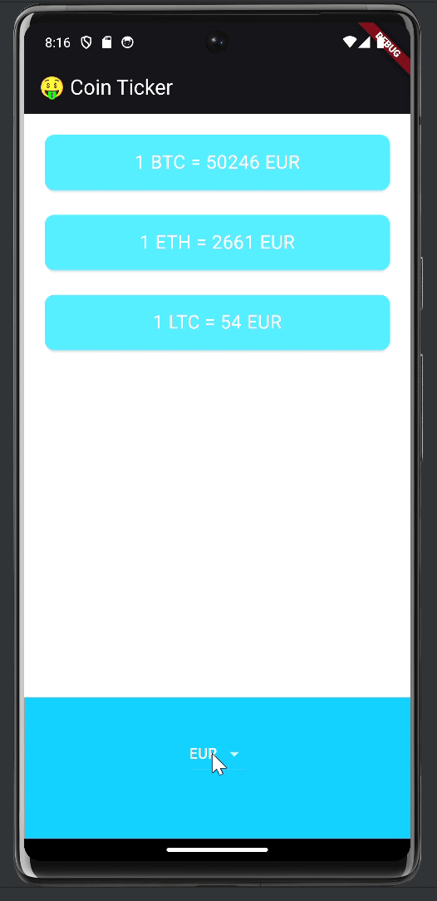

# Coin Ticker

## Description

Coin Ticker is a Flutter application that allows users to choose a currency from a dropdown and
shows the exchange rates for three types of cryptocurrencies. The app utilizes both Cupertino and
Material widgets to provide a different user interface depending on the platform. It uses
Object-Oriented Programming (OOP) principles and the `http` package to fetch exchange data from the
CoinAPI.io website. This project is part of the course "The Complete Flutter Development Bootcamp
with Dart."

## Features

- Choose a currency from a dropdown.
- Display exchange rates for Bitcoin (BTC), Ethereum (ETH), and Litecoin (LTC).
- Uses Cupertino widgets for iOS and Material widgets for Android.
- Fetches exchange data from CoinAPI.io.
- Implements OOP principles.
- Utilizes the `http` package for API requests.

## Demo

